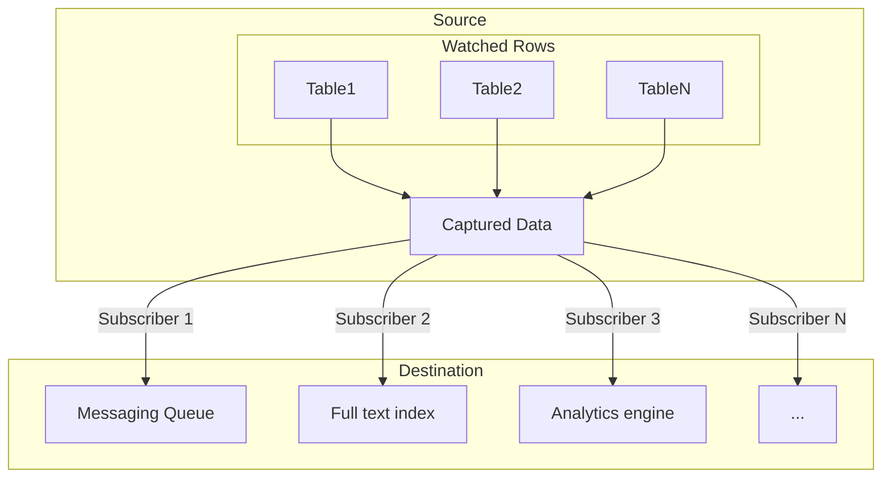

In general terms, CDC-based data integration consists of the following steps:

1. Capture changed data.
2. Transform changed data into a format your destination supports.
3. Upload the data to the destination target.

> Figure 1: We are watching for changes on N tables. 
> Those table changes are being captured and then sent to multiple destination targets.
